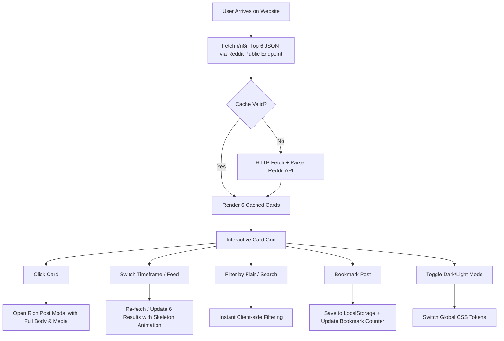

# Product Design Document (PDD)
## r/n8n Top 6 Interactive Showcase Website

**Document Version:** 1.0.0  
**Author:** Antigravity  
**File Name:** `productdesign.md`  
**Status:** Ready for Review & Implementation  
**Target Subreddit:** [r/n8n](https://www.reddit.com/r/n8n/)  

---

## 1. Executive Summary & Product Vision

### 1.1 Overview
The **r/n8n Top 6 Showcase** is a lightweight, high-performance, and visually engaging web application tailored for the automation and n8n developer community. The application fetches and curates the top 6 trending and most impactful posts from the `r/n8n` subreddit in real-time, packaging them into an interactive, node-inspired dashboard.

### 1.2 Core Value Proposition
- **Frictionless Community Discovery:** Instant glimpse into community-created workflows, nodes, questions, and showcases without Reddit clutter or algorithmic noise.
- **Fast & Interactive:** Sub-second load times, instant timeframe filtering (Daily, Weekly, Monthly, All-Time), search/flair filtering, and rich preview modals.
- **n8n Brand & Automation Aesthetic:** A modern developer-centric UI styled with n8n's signature workflow aesthetic (node links, warm gradient accents, dark/light theme, micro-interactions).

---

## 2. Target Audience & User Personas

| Persona | Motivation / Goal | Primary Pain Point Addressed |
| :--- | :--- | :--- |
| **Workflow Builders & Automators** | Look for inspiring workflows, pre-built templates, and tips from other builders. | Reddit feed is noisy; hard to filter specifically for high-signal workflow showcases. |
| **n8n Beginners & Learners** | Seek solutions to common automation bottlenecks and popular tutorials. | Long comment threads; need clean readability and direct workflow copy options. |
| **Tech Leads & Developers** | Stay updated on community sentiment, node releases, and feature requests. | Want quick executive summaries without logging into Reddit. |

---

## 3. Key Feature Specifications

### 3.1 Top 6 Dynamic Card Grid
- **Fixed 6-Item Focus:** Constrained to the top 6 posts to avoid infinite scroll fatigue and maintain high editorial quality.
- **Card Anatomy:**
  - **Flair Badge:** Color-coded categories (`Showcase`, `Workflow`, `Question`, `Discussion`, `Bug/Issue`, `Tutorial`).
  - **Score & Upvote Ratio:** Visual vote pill (e.g., `▲ 142 (98%)`).
  - **Title & Author Meta:** Post title with clamp-to-2-lines on grid, author badge (`u/username`), and relative post age (`2h ago`, `3d ago`).
  - **Thumbnail / Media Indicator:** Preview thumbnail or indicator icon for image, video, code snippet, or external URL.
  - **Engagement Stats:** Total comment count with quick-open badge.
  - **Action Toolbar:** One-click Reddit link, Share modal/clipboard copy, and Local Bookmark/Pin button.

### 3.2 Interactive Controls & Toolbar
- **Timeframe Selector:** Toggle between:
  - `Today` (`t=day`)
  - `This Week` (`t=week`) [Default]
  - `This Month` (`t=month`)
  - `All Time` (`t=all`)
- **Feed Type Switcher:** Instant switch between `Top`, `Hot`, and `Rising`.
- **Live Search & Filter by Flair:** Real-time client-side filter to highlight or filter cards matching keywords or category flairs.
- **Refresh & Auto-Sync Engine:** Manual "Refresh Feed" button with countdown indicator (e.g., *Cached 4m ago • Auto-refresh in 1m*).
- **Theme Switcher:** Seamless toggle between **n8n Dark Canvas** (default) and **Clean Paper Light**.

### 3.3 Interactive Expanded Post Modal / Drawer
- Clicking any card opens a modal overlay displaying:
  - Full title and author submission details.
  - Complete Markdown-rendered selftext/body (supporting code formatting, lists, links).
  - High-res embedded media or image gallery viewer.
  - Quick action: *"Open Discussion on Reddit"* and *"Copy Post URL"*.
  - Keyboard navigation support (`Esc` to close, `←` / `→` to jump between the 6 items).

### 3.4 Local Bookmarks / Saved Workflows
- Users can click the bookmark icon on any card to save it locally (`localStorage`).
- A dedicated "Saved (X)" toggle view allows quick reference to pinned Reddit posts across sessions.

---

## 4. User Journey & Information Architecture



---

## 5. Technical Architecture & Data Strategy

### 5.1 Data Source & API Integration
Reddit provides public JSON feeds for subreddits without requiring OAuth credentials for read-only browsing:
- **Base Endpoint:** `https://www.reddit.com/r/n8n/top.json?limit=6&t=week`
- **Alternative Feeds:**
  - `https://www.reddit.com/r/n8n/hot.json?limit=6`
  - `https://www.reddit.com/r/n8n/rising.json?limit=6`
- **Fallback Mirror:** Optional proxy / CORS-friendly fallback (e.g., `https://corsproxy.io/?url=...` or custom serverless handler) to ensure high availability.

### 5.2 Data Model Schema
```typescript
interface RedditPost {
  id: string;
  title: string;
  author: string;
  subreddit: "n8n";
  score: number;
  upvote_ratio: number;
  num_comments: number;
  created_utc: number;
  permalink: string;
  url: string;
  is_self: boolean;
  selftext: string;
  selftext_html?: string;
  link_flair_text: string | null;
  link_flair_background_color: string | null;
  thumbnail: string;
  preview?: {
    images: Array<{
      source: { url: string; width: number; height: number };
    }>;
  };
}
```

### 5.3 Caching & Performance
- **Stale-While-Revalidate (SWR):** Cache responses in `sessionStorage` / `localStorage` with a 3-minute Time-To-Live (TTL).
- **Graceful Error Handling:**
  - Fallback mockup state with simulated top n8n community posts if Reddit API rate-limits (`HTTP 429`) or client is offline.
  - Inline retry mechanism with clear status messaging.

---

## 6. UI/UX Design System & Styling Specifications

### 6.1 Color Palette & Theme Tokens

```css
/* Core Color Tokens (n8n Workflow Theme) */
:root {
  /* Dark Theme (Default) */
  --bg-primary: #0F1117;       /* Canvas Dark Slate */
  --bg-surface: #181B24;       /* Card Background */
  --bg-surface-hover: #222634; /* Elevated Card */
  --border-subtle: #2A2F3D;    /* Node Outline */
  --border-active: #FF6D5A;    /* n8n Orange Active */
  
  --text-primary: #F3F4F6;     /* Bright White */
  --text-secondary: #9CA3AF;   /* Muted Slate */
  --text-dim: #6B7280;         /* Captions & Meta */
  
  /* Brand & Accents */
  --n8n-coral: #FF6D5A;        /* n8n Primary Coral */
  --n8n-pink: #EA4B71;         /* n8n Secondary Pink */
  --accent-gradient: linear-gradient(135deg, #FF6D5A 0%, #EA4B71 100%);
  --success-green: #10B981;    /* High Upvote / Positive */
  --badge-flair-bg: #2B213A;   /* Category Chip */
  --badge-flair-text: #D8B4FE;
}

[data-theme="light"] {
  --bg-primary: #F8FAFC;
  --bg-surface: #FFFFFF;
  --bg-surface-hover: #F1F5F9;
  --border-subtle: #E2E8F0;
  --border-active: #FF6D5A;
  --text-primary: #0F172A;
  --text-secondary: #475569;
  --text-dim: #94A3B8;
}
```

### 6.2 Typography
- **Headings & Logo:** `Inter`, `Plus Jakarta Sans`, or `Outfit` (700 Bold, tracking `-0.02em`).
- **Body & Captions:** `Inter` (400 Regular, 500 Medium).
- **Code & Metadata:** `JetBrains Mono` or `Fira Code` (12px, for scores, authors, and timestamps).

### 6.3 Responsive Layout Grids
- **Desktop (≥ 1024px):** 3 Columns × 2 Rows grid with node connection visual accents.
- **Tablet (768px - 1023px):** 2 Columns × 3 Rows grid.
- **Mobile (< 768px):** 1 Column × 6 Rows stacked card list with sticky filter bar.

---

## 7. Wireframe Layout Blueprint

```
+-------------------------------------------------------------------------------+
|  [ ⚡ n8n Pulse | Top 6 Community Feed ]            [ 🌙 Theme ] [ ⭐ Saved: 0 ] |
+-------------------------------------------------------------------------------+
|  Hero: "Top 6 Trending Automations, Workflows & Insights from r/n8n"          |
|  [🔍 Search posts...]  [Today | Week ★ | Month | All]  [All Flairs ▾] [🔄 02:45] |
+-------------------------------------------------------------------------------+
|                                                                               |
|  +-----------------------+ +-----------------------+ +-----------------------+|
|  | #1 [Showcase]  ▲ 230  | | #2 [Workflow]  ▲ 184  | | #3 [Tutorial]  ▲ 156  ||
|  | AI Agent + WhatsApp   | | Multi-Tenant Postgres | | Error Trigger Guide   ||
|  | u/automation_guru     | | u/data_flow_dev       | | u/n8n_master          ||
|  | 💬 42 comments • 1d   | | 💬 19 comments • 3d   | | 💬 31 comments • 4d   ||
|  | [🔗 Open] [⭐ Bookmark]| | [🔗 Open] [⭐ Bookmark]| | [🔗 Open] [⭐ Bookmark]||
|  +-----------------------+ +-----------------------+ +-----------------------+|
|                                                                               |
|  +-----------------------+ +-----------------------+ +-----------------------+|
|  | #4 [Question]  ▲ 98   | | #5 [Showcase]   ▲ 84  | | #6 [Discussion] ▲ 72  ||
|  | Custom Python Node?   | | Notion to Slack Bot   | | Best Hosting Strategy ||
|  | u/cloud_runner        | | u/nocode_fan          | | u/devops_tom          ||
|  | 💬 55 comments • 2d   | | 💬 8 comments • 5d    | | 💬 67 comments • 6d   ||
|  | [🔗 Open] [⭐ Bookmark]| | [🔗 Open] [⭐ Bookmark]| | [🔗 Open] [⭐ Bookmark]||
|  +-----------------------+ +-----------------------+ +-----------------------+|
|                                                                               |
+-------------------------------------------------------------------------------+
|  Footer: Real-time Data sourced directly from reddit.com/r/n8n • Built for n8n |
+-------------------------------------------------------------------------------+
```

---

## 8. Edge Cases & Resilience Strategy

| Edge Case | Potential Impact | Mitigation Strategy |
| :--- | :--- | :--- |
| **Reddit API Rate Limiting (HTTP 429)** | User sees blank screen or failure message. | Stored fallback mock data displays automatically with banner: *"Viewing cached snapshot (API rate limited)"*. |
| **NSFW / Spoiler Content** | Inappropriate preview thumbnail. | Strict filtering: bypass or blur thumbnails if `over_18` or `spoiler` flags are true. |
| **Extra Long Post Titles** | Grid card layout distortion. | CSS `display: -webkit-box; -webkit-line-clamp: 2;` with tooltip on hover. |
| **Network Disconnection** | App fails to fetch new timeframes. | Display offline banner and fallback to cached `localStorage` items. |
| **Post Without Flair** | Card layout lacks category chip. | Assign default fallback flair `Community` with neutral styling. |

---

## 9. Implementation Roadmap

### Phase 1: Foundation & Data Fetching (Day 1)
- [x] Create project layout and design document (`productdesign.md`).
- [ ] Implement Reddit JSON API fetcher with timeframe parameters.
- [ ] Implement local cache layer with 3-minute TTL.

### Phase 2: Core Grid & Interactive UI (Day 2)
- [ ] Build 3x2 responsive card grid with n8n workflow aesthetic.
- [ ] Implement loading skeletons and smooth fade-in animations.
- [ ] Create Timeframe tabs (`Today`, `Week`, `Month`, `All`) and Feed Switcher.

### Phase 3: Modals & Advanced Interactivity (Day 3)
- [ ] Build full Markdown post preview modal with media preview.
- [ ] Implement live search and flair filtering.
- [ ] Add bookmarking system backed by `localStorage`.

### Phase 4: Polish & Quality Assurance (Day 4)
- [ ] Implement Dark/Light theme toggle.
- [ ] Add keyboard navigation shortcuts (`Esc`, Arrow keys).
- [ ] Optimize SEO metadata, accessibility (ARIA labels), and lighthouse performance score (95+).

---

## 10. Document Credit & Metadata
- **Document Created By:** Antigravity AI
- **Repository Location:** `productdesign.md`
- **Associated Subreddit:** `r/n8n`
- **Revision Date:** August 27, 2026
